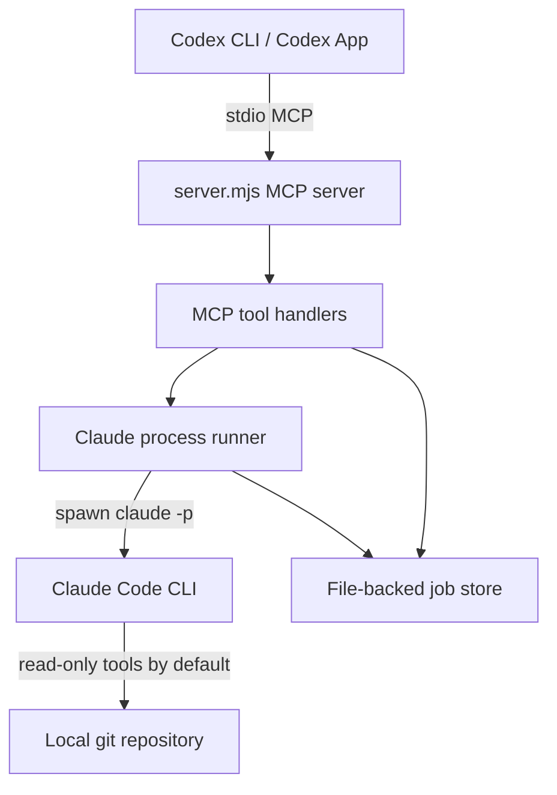
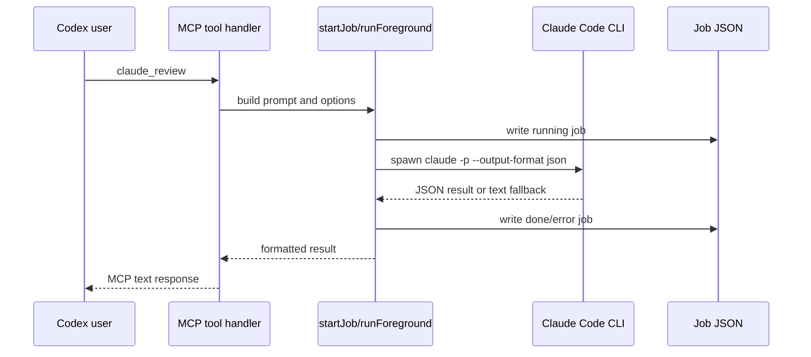
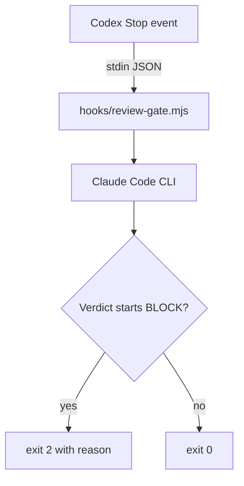

# Codebase Map: Architecture

Date: 2026-06-08

## Product Shape

`claude-for-codex` is a local bridge that lets Codex ask Claude Code for review
and rescue workflows.

The current product surface is:

- MCP tools for manual, on-demand use.
- Optional slash-command prompts for a friendlier team workflow.
- Optional Codex `Stop` hook for users who intentionally want automatic review.

The intended default rollout path is manual use, not automatic review.

## Current Runtime Architecture

The current `dev` branch is a single-process Node MCP server.

There is no daemon, queue service, or remote backend. Codex starts the MCP
server process locally.

## Main Module Responsibilities

`server.mjs` currently contains multiple responsibilities:

- Environment configuration.
- Repo root and repo hash resolution.
- Job path and job JSON persistence helpers.
- Last Claude session persistence.
- Live child-process tracking for cancellation.
- Claude CLI argument construction.
- Foreground/background execution.
- Prompt construction.
- MCP server and tool registration.

This is acceptable for the bootstrap prototype but is the main pressure point
for feature growth. The active direction is to extract durable state/job-store
logic behind a small core boundary.

## MCP Tool Layer

Tools are registered directly with `server.registerTool`.

Current tools:

- `claude_setup`
- `claude_review`
- `claude_adversarial_review`
- `claude_rescue`
- `claude_status`
- `claude_result`
- `claude_cancel`

Tool input schemas are declared inline with `zod`.

Handlers are thin in intent, but they currently depend on helpers defined in
the same file.

## Claude Execution Flow

Foreground review flow:

Background flow is the same execution path except the tool returns the task id
immediately and the process completion updates the job record later.

## State Model

Persisted state:

- One JSON file per job.
- One `last-session.txt` per repo key.

In-memory state:

- `live` map from task id to spawned child process.

Job fields currently include:

- `id`
- `kind`
- `status`
- `cwd`
- `model`
- `background`
- `startedAt`
- `pid`
- `sessionId`
- `exitCode`
- `result`
- optional `endedAt`
- optional `costUsd`
- optional `numTurns`

Current statuses are `running`, `done`, `error`, and `cancelled`.

## Safety Boundary

Default Claude runs are read-only.

Read-only mode passes:

- `--allowedTools Read,Grep,Glob,Bash(git diff:*),Bash(git log:*),Bash(git status:*),Bash(git show:*)`
- `--disallowedTools Edit,Write,MultiEdit,NotebookEdit`

`claude_rescue` can opt into write access with `allow_write: true`. That path
passes `--dangerously-skip-permissions`, so it is a deliberate trust boundary.

## Hook Architecture

The hook is intentionally separate from the MCP server.

This makes the hook easy to install or remove independently. It also means hook
configuration and MCP configuration can drift unless future work centralizes
shared settings.

## Documentation Architecture

The docs currently serve as part of the product surface:

- `README.md`: product positioning and quick start.
- `docs/SETUP.md`: installation and usage.
- `docs/DESIGN.md`: feature mapping and mechanics.
- `docs/PUBLISHING.md`: repository/package publishing guidance.
- `docs/ADR-001-manual-mcp-first-hooks-opt-in.md`: design decision record.
- `docs/superpowers/specs/...`: earlier design/spec artifact.

Docs are currently committed and packaged selectively. Planning maps live under
`.planning/codebase/` and are project planning artifacts, not npm package files.
